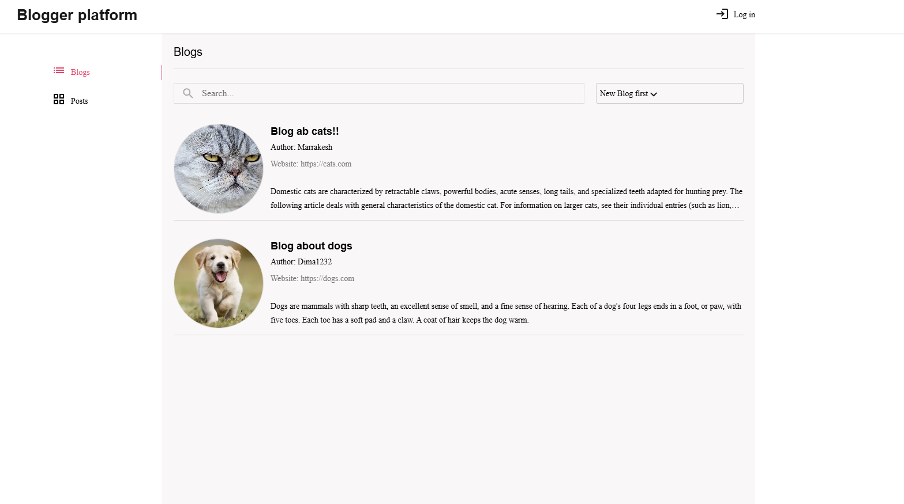
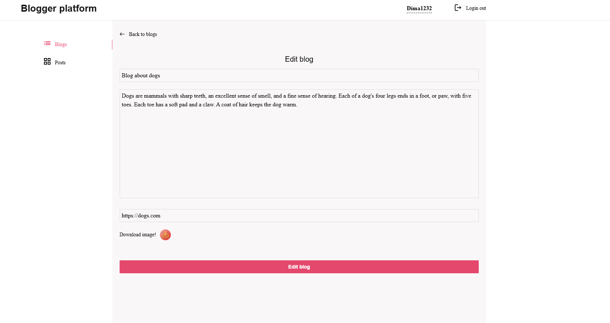
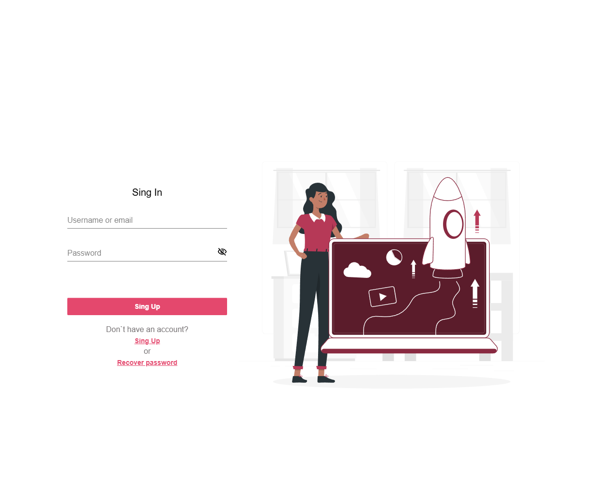

# 📝 Blog App — Angular Frontend

**Blog Frontend** is the client-side of a fullstack blogging platform, built with **Angular 17**, **NgRx Store**, and **Module**. It provides a user-friendly interface for reading, creating, editing, and managing blog posts with full state management and API integration.

---

### 🔗 Live Demo

Check out the deployed version:  
👉 [**Blog App — Live Site**](https://blog-frontend-angular-eight.vercel.app)


---

## 📸 Screenshots

### 🏠 Blog Homepage


### 📝 Editor & Post View


### 🔐 Auth (Login/Register)



---

## 🚀 Technologies Used

- **Angular 17** (Modules)
- **NgRx** – Store, Effects, Entity
- **RxJS** – Observables and reactive data flow
- **SCSS** – Styling
- **Angular Router** – Routing & lazy loading
- **REST API** – Integrated backend (NestJS)

---

## 📦 Features

- ✅ View blog posts by all users
- ✅ View post details
- ✅ Register and login users
- ✅ Create / Edit / Delete your own posts
- ✅ Like posts and comments
- ✅ Responsive UI for mobile and desktop
- ✅ State management with NgRx (Store, Effects, Selectors)

---

## 🧑‍💻 Getting Started

### 1. Clone the repository

```bash
git clone https://github.com/Dmytro-Doronin/blog-frontend-Angular.git
cd blog-frontend-Angular

### 2. Install dependencies

npm install
